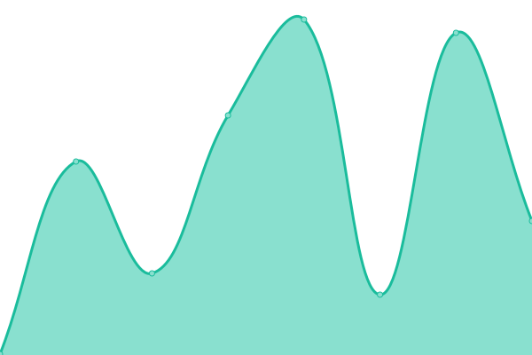

# [📈 Live Status](https://antosnio.github.io/upptime): <!--live status--> **🟩 All systems operational**

This repository contains the open-source uptime monitor and status page for [antosnio](https://antosnio.github.io/upptime), powered by [Upptime](https://github.com/upptime/upptime).

With [Upptime](https://upptime.js.org), you can get your own unlimited and free uptime monitor and status page, powered entirely by a GitHub repository. We use [Issues](https://github.com/antosnio/upptime/issues) as incident reports, [Actions](https://github.com/antosnio/upptime/actions) as uptime monitors, and [Pages](https://antosnio.github.io/upptime) for the status page.

<!--start: status pages-->
<!-- This summary is generated by Upptime (https://github.com/upptime/upptime) -->
<!-- Do not edit this manually, your changes will be overwritten -->
<!-- prettier-ignore -->
| URL | Status | History | Response Time | Uptime |
| --- | ------ | ------- | ------------- | ------ |
|  [Ricar](https://www.ricar.cl) | 🟩 Up | [ricar.yml](https://github.com/Antosnio/upptime/commits/HEAD/history/ricar.yml) | 

 254ms
     
 | 

<a href="https://Antosnio.github.io/upptime/history/ricar">100.00%</a>
    

|  [Admin Sublimonkeys](https://admin.sublimonkeys.cl) | 🟩 Up | [admin-sublimonkeys.yml](https://github.com/Antosnio/upptime/commits/HEAD/history/admin-sublimonkeys.yml) | 

 184ms
     
 | 

<a href="https://Antosnio.github.io/upptime/history/admin-sublimonkeys">100.00%</a>
    

|  [QA sublimonkeys](https://qa.sublimonkeys.cl) | 🟩 Up | [qa-sublimonkeys.yml](https://github.com/Antosnio/upptime/commits/HEAD/history/qa-sublimonkeys.yml) | 

 186ms
     
 | 

<a href="https://Antosnio.github.io/upptime/history/qa-sublimonkeys">100.00%</a>
    

|  [Api Sublimonkeys](https://api.sublimonkeys.cl) | 🟩 Up | [api-sublimonkeys.yml](https://github.com/Antosnio/upptime/commits/HEAD/history/api-sublimonkeys.yml) | 

 432ms
     
 | 

<a href="https://Antosnio.github.io/upptime/history/api-sublimonkeys">100.00%</a>
    

<!--end: status pages-->

[**Visit our status website →**](https://antosnio.github.io/upptime)

## 📄 License

- Powered by: [Upptime](https://github.com/upptime/upptime)
- Code: [MIT](./LICENSE) © [antosnio](https://antosnio.github.io/upptime)
- Data in the `./history` directory: [Open Database License](https://opendatacommons.org/licenses/odbl/1-0/)
